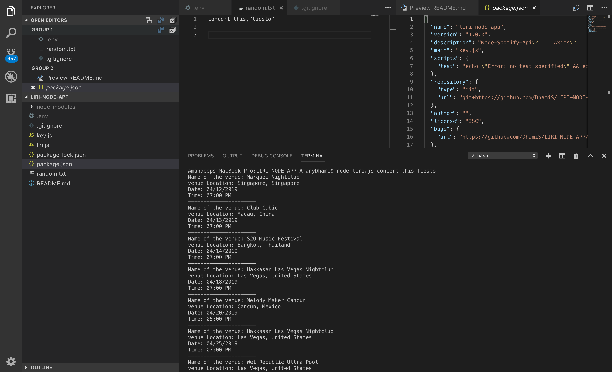

## liri-node-app

### Node Package Installed

    Node-Spotify-Api
    Axios
    Moment
    DotEnv

### About

- This app has 4 phase:

  1. concert-this:

       

  2. spotify-this-song:

       

  3. movie-this:

       

  4. do-what-it-says:

    

    

    

### Programs Used:

- Javascript
- Node
